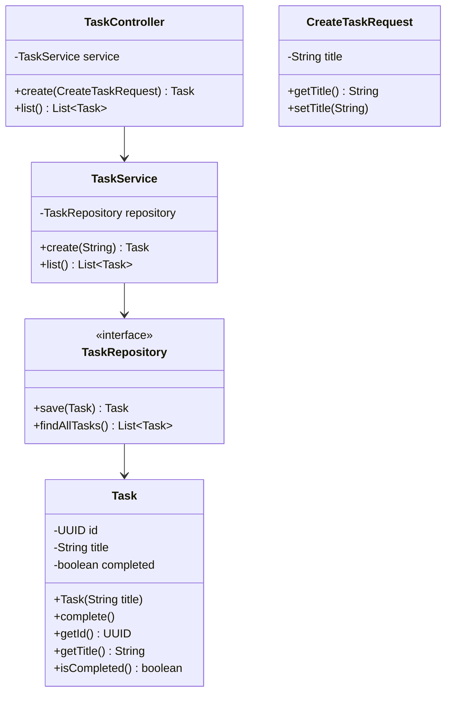

# TaskManager

Uma aplicação simples de gerenciamento de tarefas construída com Spring Boot, seguindo os princípios da Arquitetura Hexagonal.

## Visão Geral da Arquitetura

A aplicação é estruturada em camadas conforme a Arquitetura Hexagonal:

- **Domain**: Contém as entidades de negócio.
- **Application**: Contém os serviços de aplicação e DTOs.
- **Infrastructure**: Contém a implementação dos repositórios (JPA).
- **Adapter**: Contém os adaptadores de entrada, como controladores REST.

## Diagrama de Classes



## Como Executar

### Pré-requisitos
- Java 17 ou superior
- Maven
- PostgreSQL (via Docker Compose)

### Passos
1. Clone o repositório.
2. Navegue para o diretório do projeto.
3. Inicie o banco de dados: `docker-compose up -d`
4. Execute `mvn spring-boot:run` ou `java -jar target/TaskManager-0.0.1-SNAPSHOT.jar`.

A aplicação será iniciada na porta 8050.

## Endpoints da API

- **POST /tasks**: Cria uma nova tarefa.
  - Corpo da requisição: `{"title": "Título da tarefa"}`
  - Resposta: Objeto Task criado.

- **GET /tasks**: Retorna todas as tarefas.
  - Resposta: Lista de objetos Task.

## Tecnologias Utilizadas
- Spring Boot
- Spring Data JPA
- PostgreSQL
- Maven

## Estrutura de Pastas

A estrutura de pastas segue os princípios da Arquitetura Hexagonal, organizando o código em camadas distintas:

```
TaskManager/
├── docker-compose.yml
├── HELP.md
├── mvnw
├── mvnw.cmd
├── pom.xml
├── README.md
├── src/
│   ├── main/
│   │   ├── java/
│   │   │   └── com/
│   │   │       └── soturno/
│   │   │           └── TaskManager/
│   │   │               ├── TaskManagerApplication.java
│   │   │               ├── adapter/
│   │   │               │   └── in/
│   │   │               │       └── task/
│   │   │               │           └── TaskController.java
│   │   │               ├── application/
│   │   │               │   └── task/
│   │   │               │       ├── TaskService.java
│   │   │               │       └── dto/
│   │   │               │           └── CreateTaskRequest.java
│   │   │               ├── domain/
│   │   │               │   └── task/
│   │   │               │       └── Task.java
│   │   │               └── infrastructure/
│   │   │                   ├── config/
│   │   │                   ├── exception/
│   │   │                   └── task/
│   │   │                       └── TaskRepository.java
│   │   └── resources/
│   │       └── application.yml
│   └── test/
│       └── java/
│           └── com/
│               └── soturno/
│                   └── TaskManager/
│                       └── TaskManagerApplicationTests.java
└── target/
    ├── TaskManager-0.0.1-SNAPSHOT.jar
    ├── TaskManager-0.0.1-SNAPSHOT.jar.original
    └── classes/
        ├── application.yml
        └── com/
            └── soturno/
                └── TaskManager/
                    ├── TaskManagerApplication.class
                    ├── adapter/
                    │   └── in/
                    │       └── task/
                    │           └── TaskController.class
                    ├── application/
                    │   └── task/
                    │       ├── TaskService.class
                    │       └── dto/
                    │           └── CreateTaskRequest.class
                    ├── domain/
                    │   └── task/
                    │       └── Task.class
                    └── infrastructure/
                        └── task/
                            └── TaskRepository.class
```
