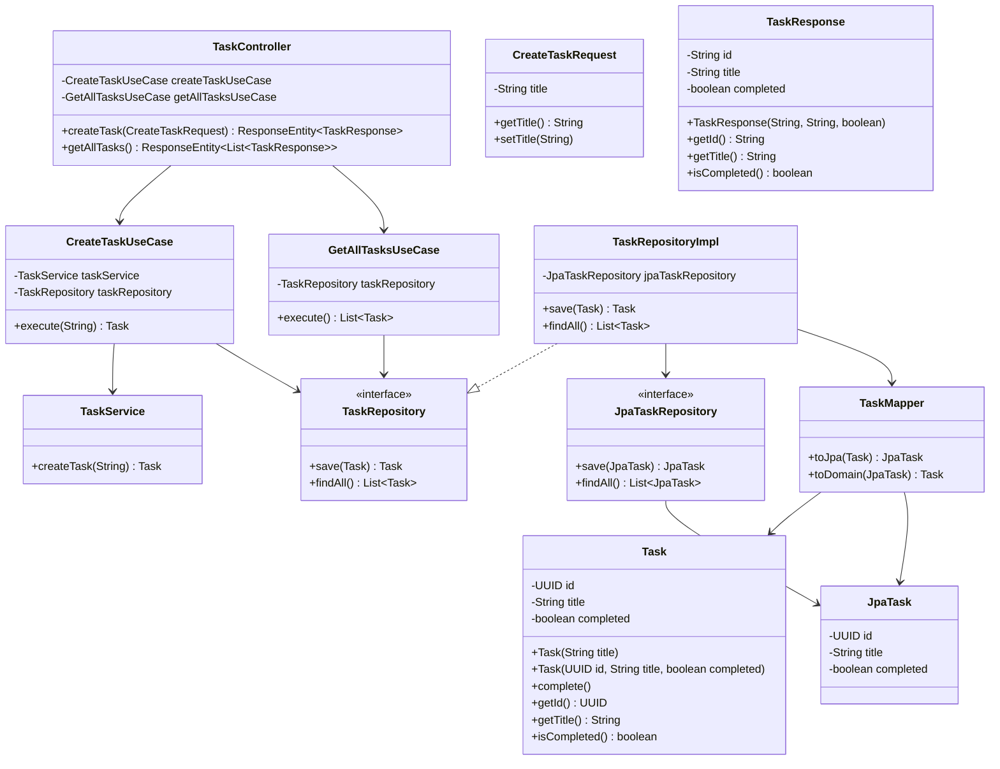

# TaskManager

Uma aplicação simples de gerenciamento de tarefas construída com Spring Boot, seguindo os princípios da Arquitetura Hexagonal.

## Visão Geral da Arquitetura

A aplicação é estruturada em camadas conforme a Arquitetura Hexagonal:

- **Domain**: Contém as entidades de negócio, interfaces de repositório e serviços de domínio.
- **Application**: Contém os casos de uso (use cases) que orquestram a lógica de aplicação.
- **Infrastructure**: Contém a implementação dos repositórios, mapeadores e configurações de infraestrutura (JPA).
- **Adapter**: Contém os adaptadores de entrada, como controladores REST.

## Diagrama de Classes



## Como Executar

### Pré-requisitos
- Java 17 ou superior
- Maven

### Passos
1. Clone o repositório.
2. Navegue para o diretório do projeto.
3. Execute `mvn spring-boot:run` ou `java -jar target/TaskManager-0.0.1-SNAPSHOT.jar`.

A aplicação será iniciada na porta 8080.

## Endpoints da API

- **POST /tasks**: Cria uma nova tarefa.
  - Corpo da requisição: `{"title": "Título da tarefa"}`
  - Resposta: Detalhes da tarefa criada.

- **GET /tasks**: Retorna todas as tarefas.
  - Resposta: Lista de tarefas.

## Tecnologias Utilizadas
- Spring Boot
- Spring Data JPA
- H2 Database (ou configure outro no application.yml)
- Maven

## Estrutura de Pastas

A estrutura de pastas segue os princípios da Arquitetura Hexagonal, organizando o código em camadas distintas:

```
TaskManager/
├── docker-compose.yml
├── HELP.md
├── mvnw
├── mvnw.cmd
├── pom.xml
├── README.md
├── src/
└──├── main/
   │   ├── java/
   │   │   └── com/
   │   │       └── soturno/
   │   │           └── TaskManager/
   │   │               ├── TaskManagerApplication.java
   │   │               ├── adapter/
   │   │               │   └── in/
   │   │               │       └── task/
   │   │               │           └── TaskController.java
   │   │               ├── application/
   │   │               │   └── task/
   │   │               │       ├── CreateTaskUseCase.java
   │   │               │       └── GetAllTasksUseCase.java
   │   │               ├── domain/
   │   │               │   └── task/
   │   │               │       ├── Task.java
   │   │               │       ├── TaskRepository.java
   │   │               │       └── TaskService.java
   │   │               └── infrastructure/
   │   │                   ├── config/
   │   │                   ├── exception/
   │   │                   └── task/
   │   │                       ├── JpaTask.java
   │   │                       ├── JpaTaskRepository.java
   │   │                       ├── TaskMapper.java
   │   │                       └── TaskRepositoryImpl.java
   │   └── resources/
   │       └── application.yml
   └── test/
       └── java/
           └── com/
               └── soturno/
                   └── TaskManager/
                       └── TaskManagerApplicationTests.java

```
