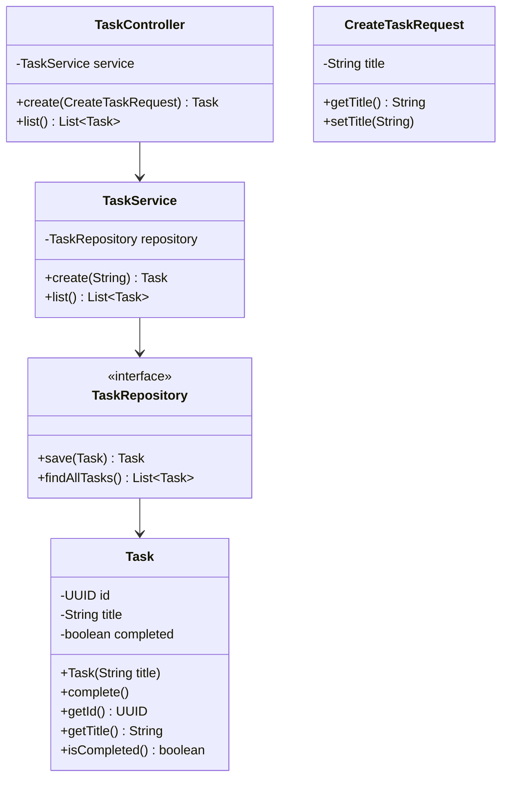

# TaskManager

TaskManager é uma aplicação RESTful para gerenciamento de tarefas, construída com Spring Boot e arquitetura hexagonal. Permite criar e listar tarefas, resolvendo a necessidade de um sistema simples e escalável para controle de atividades.

**Problema resolvido**: Fornece uma API para CRUD básico de tarefas, com persistência em banco de dados, ideal para integrações ou aplicações front-end.

**Stack**: Java 21, Spring Boot, Spring Data JPA, PostgreSQL, Maven.

## Arquitetura Hexagonal

A arquitetura separa responsabilidades em camadas independentes:

- **Domain**: Entidades de negócio (ex: Task).
- **Application**: Lógica de aplicação e DTOs (ex: TaskService, CreateTaskRequest).
- **Infrastructure**: Implementações externas (ex: repositórios JPA).
- **Adapter**: Interfaces de entrada/saída (ex: REST controllers).

Isso permite testes isolados, fácil substituição de tecnologias e manutenção.

## Diagrama de Classes



## Como Executar

### Pré-requisitos
- Java 21
- Maven
- Docker e Docker Compose

### Passos
1. Clone o repositório.
2. Navegue para o diretório do projeto.
3. Execute `docker-compose up -d` para subir a estrutura basica do projeto.
4. Execute `mvn spring-boot:run`.

A aplicação inicia na porta 8050. O comando `docker-compose up -d` sobe o banco PostgreSQL, permitindo persistência de dados.

## Acessos Locais
- **API**: http://localhost:8080/tasks
- **Actuator (health, info)**: http://localhost:8080/actuator

## Configuração da Aplicação
A aplicação conecta ao PostgreSQL via Docker Compose. Variáveis em `application.yml`:
- `DB_HOST`: localhost (padrão)
- `DB_PORT`: 5432
- Para produção, ajuste `spring.datasource.url` com variáveis de ambiente.

## Endpoints
- **POST /tasks**: Cria tarefa.
  - Request: `{"title": "Minha tarefa"}`
  - Response: `{"id": "uuid", "title": "Minha tarefa", "completed": false}`
- **GET /tasks**: Lista tarefas.
  - Response: `[{"id": "uuid", "title": "Minha tarefa", "completed": false}]`

## Tecnologias
- Java 21
- Spring Boot
- Spring Data JPA
- PostgreSQL
- Maven
- Docker

## Estrutura de Pastas

```
TaskManager/
├── docker-compose.yml
├── HELP.md
├── mvnw
├── mvnw.cmd
├── pom.xml
├── README.md
├── src/
└──├── main/
   │   ├── java/
   │   │   └── com/
   │   │       └── soturno/
   │   │           └── TaskManager/
   │   │               ├── TaskManagerApplication.java
   │   │               ├── adapter/
   │   │               │   └── in/
   │   │               │       └── task/
   │   │               │           └── TaskController.java
   │   │               ├── application/
   │   │               │   └── task/
   │   │               │       ├── TaskService.java
   │   │               │       └── dto/
   │   │               │           └── CreateTaskRequest.java
   │   │               ├── domain/
   │   │               │   └── task/
   │   │               │       └── Task.java
   │   │               └── infrastructure/
   │   │                   ├── config/
   │   │                   ├── exception/
   │   │                   └── task/
   │   │                       └── TaskRepository.java
   │   └── resources/
   │       └── application.yml
   └── test/
       └── java/
           └── com/
               └── soturno/
                   └── TaskManager/
                       └── TaskManagerApplicationTests.java
```
